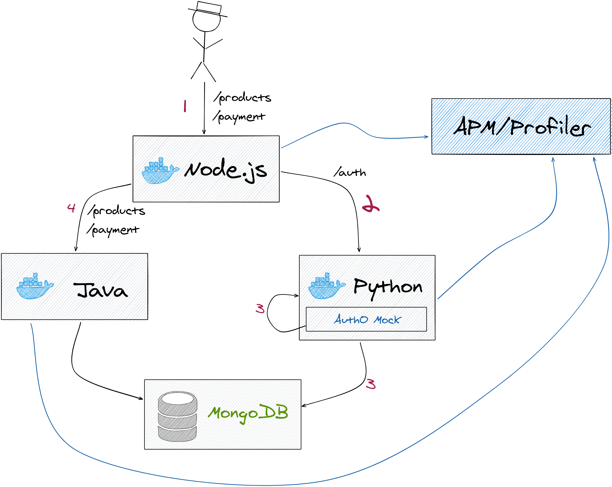

# APMs and distributed tracing
👋 We know you're here because you're having performance problems with your app. Don't worry, we will help you!

👀 **How?** *(you're asking?)*

It's simple. We have created this lab environment to get you started in the wonderful world of APMs and distributed tracing.

In the sections below, you will find how to deploy this sample project and use it as your playground to explore the many benefits you can get from active performance monitoring with laser precision to pinpoint issues and better focus your optimization efforts.

<!-- toc -->

- [What's in the box?](#whats-in-the-box)
- [Application architecture](#application-architecture)
- [Running locally](#running-locally)
- [Instrumentation](#instrumentation)
  * [Node.js](#nodejs)
  * [Java](#java)
  * [Python](#python)
- [Running performance tests](#running-performance-tests)
- [Results visualization](#results-visualization)

<!-- tocstop -->

## What's in the box?

```
microservices-hackathon-4
├── apm-server (Elastic APM server configuration)
├── infrastructure (Terraform infrastructure deployment)
├── java-api (Java API)
├── node-api (Node API)
├── performance (Performance testing scripts and pipelines)
├── python-api (Python API)
└── docker-compose.yml
```

## Application architecture
This is a small microservices app composed of three stateless services built with the most popular programming languages/platforms out there: Node.js, Java, Python, and a Mongo database.

At the bottom of the image you will find the detailed API contracts.



<details>
<summary><b>API contracts</b> (click expand to visualize them)</summary>
<p>

```yaml
node-api: gateway api
python-api: auth api
java-api: business api

node-api -> python-api:
  authentication:
    request:
      path: http://python-api.com/auth/{token}
      method: GET
      description: token is a string with user data in the form username:password in base64
    response:
      success:
        code: 200
        body: none
      failed:
        code: 401
        body:
          text: Login failed

node-api -> java-api:
  get-products:
    request:
      path: http://java-api.com/products
      method: GET
    response:
      success:
        code: 200
        body:
          json:
            [
              { name: "product1", price: 200, description: "", image: "" },
              { name: "product2", price: 300, description: "", image: "" },
              ...,
            ]
      failed:
        code: 404
        body:
          text: No products found

  make-payment:
    request:
      path: http://java-api.com/payments
      method: POST
      body:
        json: { product: "product1", quantity: 10, card: "5465887168" }
    response:
      success:
        code: 201
        body:
          text: Payment successfully completed
      failed:
        code: 400
        body:
          text: Payment failed. Insufficient funds
```
    
</p>
</details>

## Running locally
Change directory to the root of the project and run the command below.

```bash
docker-compose up
```

Verify all the services are up and running:

| Service       | URL |
|:--------------|:--------|
| Node API      | http://localhost |
| Java API      | http://localhost:8085/actuator/health     |
| Python API    | http://localhost:8000/admin  |
| Elastic APM   | http://localhost:5601/app/apm   |

## Instrumentation
### Node.js
To configure the APM in a Node.js application follow these steps:

1. Install the APM agent for Node.js as a dependency to your application:

    ``` bash
    npm install elastic-apm-node --save
    ```

2. Add the following code snippet to the application entry point file (usually app.js or sever.js):

    ```javascript
    // Add this to the VERY top of the file
    var apm = require("elastic-apm-node").start({
      // Override service name from package.json
      // Allowed characters: a-z, A-Z, 0-9, -, _, 
      // and space
      serviceName: "node-api",

      // Set custom APM Server URL
      // Default: http://localhost:8200
      serverUrl: "http://apm-server:8200",
    });
    ```
For more configuration options refer to the [documentation](https://www.elastic.co/guide/en/apm/agent/nodejs/current/index.html).

### Java
To configure the APM in a Java application you can adjust it in the following docker file:

    ```
    FROM openjdk:11
    EXPOSE 8085
    RUN mkdir -p /app/
    ADD build/libs/java-api-1.0-SNAPSHOT.jar /app/java-api-1.0-SNAPSHOT.jar
    # Download apm agent 
    RUN wget -O apm-agent.jar https://search.maven.org/remotecontent?filepath=co/elastic/apm/elastic-apm-agent/1.2.0/elastic-apm-agent-1.2.0.jar
    # Set apm configuration
    CMD ["java","-javaagent:/apm-agent.jar", "-Delastic.apm.service_name=service-javaapi", "-Delastic.apm.application_packages=org.perficient", "-Delastic.apm.server_urls=http://apm-server:8200", "-jar", "/app/java-api-1.0-SNAPSHOT.jar"]
    ```

### Python

## Running performance tests
Download and install latest version of JMeter from https://jmeter.apache.org/download_jmeter.cgi

Use JMeter to open any of the JMX (JMeter scripts) from the [test-plans](performance/tests-plans/applications/node-api/transactions/benchmark) folder, and then hit the green "play" button to run the tests. You should start seeing the results in the APM (see next section).

## Results visualization
Please feel free to explore each and every option here 😉 http://localhost:5601/app/apm
